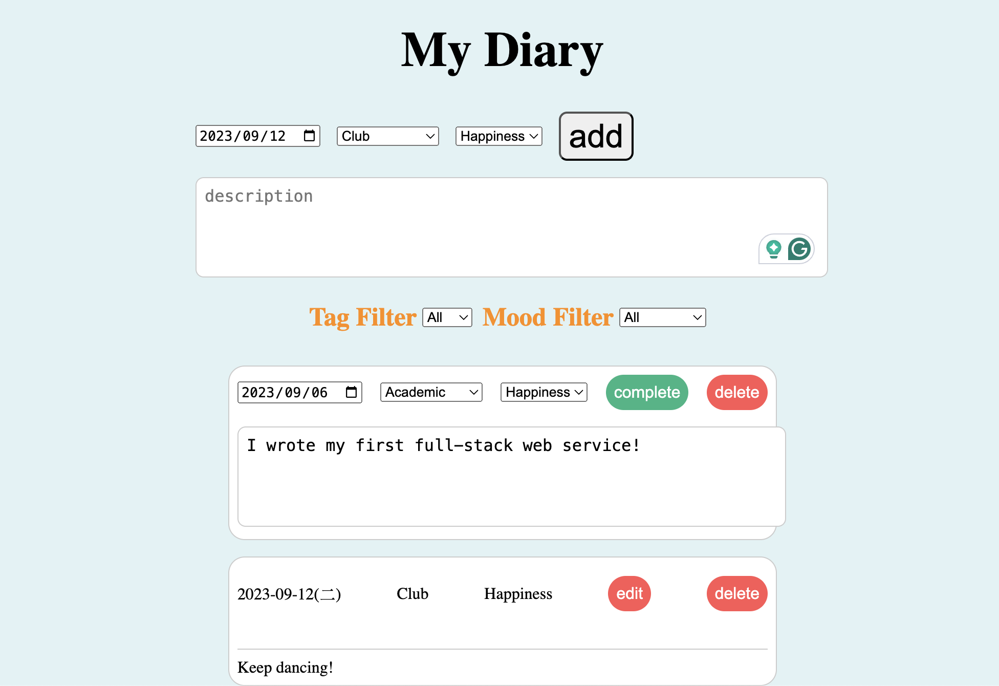

# My Diary



## Features
1. Filter: implement the filter function on the homepage. The categories for filtering should at least include Academic, Interpersonal, Club, Happiness, Anger, Sadness. Only the selected diary cards should be displayed after filtering.
2. When adding a new diary card, it should be possible to change the date of the diary card. It is necessary to verify that the date is valid. If the date is not valid (e.g., February 30, 2022, or January 13, 2023), the diary card cannot be saved.

## Run this Project
1. Create an .env file in the backend.
    ```bash
    PORT=8000
    MONGO_URL=Your MongoDB URL
    ```
    If you don't have local mongoDB, You can register an [account](https://account.mongodb.com/account/login?n=https%3A%2F%2Fcloud.mongodb.com%2Fv2%2F6476e9c30218671262839b91&nextHash=%23clusters&signedOut=true) in here to use online database.

2. init this project
    ```
    cd backend
    yarn
    cd ..
    cd frontend
    yarn
    ```
3. starting backend and frontend
    ```
    cd frontend
    yarn start
    cd ..
    cd backend
    yarn start
    ```

4. open the page by browser
using this URL: http://localhost:5173/