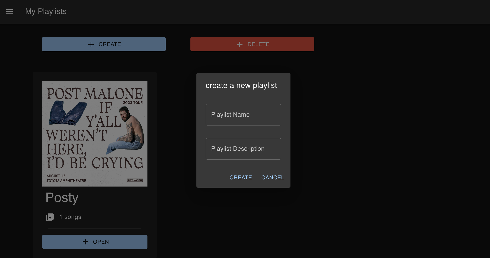
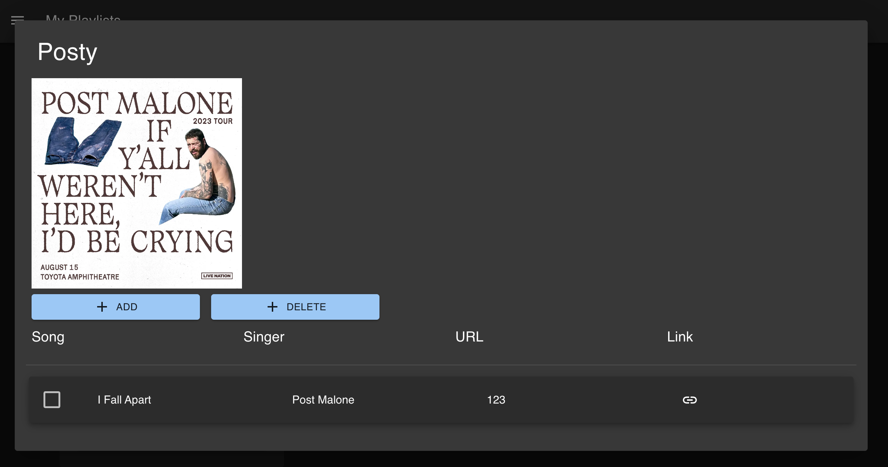

# My Playlists




## Run this Project
1. Create an .env file in the backend.
    ```bash
    PORT=8000
    MONGO_URL="mongodb+srv://<username>:<password>@<cluster>.example.mongodb.net/?retryWrites=true&w=majority"
    ```
    then Create an .env file in the frontend.
    ```bash
    VITE_API_URL="http://localhost:8000/api"
    ```


2. init this project
    ```bash
    cd frontend
    yarn
    cd ..
    cd backend
    yarn
    ```

3. starting backend and frontend
    ```bash
    cd frontend
    yarn dev
    cd ..
    cd backend
    yarn start
    ```

4. open the page by browser
using this URL: http://localhost:5173/
